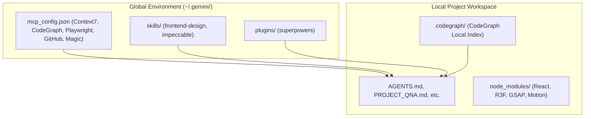

# Global Setup Guide

This document describes the global Antigravity (`agy`) CLI environment and how it integrates with local project-level configuration files to build premium 3D websites.

## 1. Global Skills vs Project-Level Files



- **Global Setup**: Maintains developer tools, indexing protocols, standard guidelines, browser testing runtimes, and planning engines.
- **Local Project Setup**: Controls styling tokens, custom components, asset licensing, scene construction, and project-specific dependencies.

---

## 2. Core Global MCP Configurations

The active global config is located at `C:\Users\HP\.gemini\config\mcp_config.json`. The config maintains the following servers:

1. **Context7 (`context7`)**: Serves library documentation for React, Vite, Three.js, R3F, Drei, GSAP, Motion, Lenis, and Theatre.js.
2. **CodeGraph (`codegraph`)**: Indexing engine for symbol lookup, dependency relationships, and codebase structure.
3. **Playwright (`playwright`)**: Headless browser runtime for responsiveness checking, rendering testing, and visual review.
4. **GitHub (`github`)**: Read-only connection to repository metadata.
5. **Magic (`magic`)**: Component variations catalog via 21st.dev.
6. **Sequential-Thinking (`sequential-thinking`)**: Multi-step reasoning tool for complex architecture problems.

---

## 3. Core Global Skills

1. **Superpowers**: Main planning, spec creation, execution looping, and verification.
2. **Frontend Design**: Official Anthropic skill for visual direction, layouts, and typography critiques to avoid template outputs.
3. **Impeccable**: General high-fidelity assistant behavior directives.

---

## 4. Security & Credentials Policy

> [!CAUTION]
> **Never hardcode secrets, tokens, API keys, or headers inside code or markdown files.**
> 
> Environment variables or configuration tokens must only reside in `mcp_config.json` inside the respective `env` or `headers` blocks. Write placeholders in documentation:
> - Context7: `YOUR_CONTEXT7_API_KEY`
> - GitHub: `YOUR_GITHUB_PAT`
> - 21st.dev: `YOUR_21ST_DEV_API_KEY`

---

## 5. Startup Prompt Template

When starting a session or bootstrapping a project, prompt the agent with:

```text
You are my Antigravity creative developer. Check agy plugin list to confirm superpowers is active, and read global frontend-design skill instructions. Perform a CodeGraph index update, review local documents, and let's align on the project brief before writing code.
```

---

## Open Design

Role:
Open Design is the design exploration and artifact generation layer before final implementation.

Current setup:
* Open Design MCP is connected through packaged app sidecar.
* Desktop app must remain open for active context-aware actions.
* Active context may expire after user inactivity.

Use:
* design exploration
* artifact previews
* multiple visual directions
* design system experiments
* layout/typography/motion drafts

Do not use:
* as replacement for local project rules
* as replacement for final implementation architecture
* as replacement for Playwright QA
* as replacement for CodeGraph review
* as source of blindly pasted code

Open Design creates direction.
The Antigravity system builds the final website.
