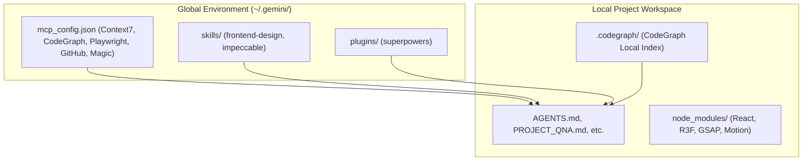

# Global Setup Guide

This document describes the global Antigravity (`agy`) CLI environment and how it integrates with local project-level configuration files to build premium 3D websites.

## 1. Global Skills vs Project-Level Files



- **Global Setup**: Maintains developer tools, indexing protocols, standard guidelines, browser testing runtimes, and planning engines.
- **Local Project Setup**: Controls styling tokens, custom components, asset licensing, scene construction, and project-specific dependencies.

---

## 2. Core Global MCP Configurations

The active global config is located at `C:\Users\HP\.gemini\config\mcp_config.json`. The config maintains the following servers:

1. **Context7 (`context7`)**: Serves library documentation for React, Vite, Three.js, R3F, Drei, GSAP, Motion, Lenis, and Theatre.js.
2. **CodeGraph (`codegraph`)**: Indexing engine for symbol lookup, dependency relationships, and codebase structure.
3. **Playwright (`playwright`)**: Headless browser runtime for responsiveness checking, rendering testing, and visual review.
4. **GitHub (`github`)**: Read-only connection to repository metadata.
5. **Magic (`magic`)**: Component variations catalog via 21st.dev.
6. **Sequential-Thinking (`sequential-thinking`)**: Multi-step reasoning tool for complex architecture problems.

---

## 3. Core Global Skills

1. **Superpowers**: Main planning, spec creation, execution looping, and verification.
2. **Frontend Design**: Official Anthropic skill for visual direction, layouts, and typography critiques to avoid template outputs.
3. **Impeccable**: General high-fidelity assistant behavior directives.

---

## 4. Security & Credentials Policy

> [!CAUTION]
> **Never hardcode secrets, tokens, API keys, or headers inside code or markdown files.**
> 
> Environment variables or configuration tokens must only reside in `mcp_config.json` inside the respective `env` or `headers` blocks. Write placeholders in documentation:
> - Context7: `YOUR_CONTEXT7_API_KEY`
> - GitHub: `YOUR_GITHUB_PAT`
> - 21st.dev: `YOUR_21ST_DEV_API_KEY`

---

## 5. Startup Prompt Template

When starting a session or bootstrapping a project, prompt the agent with:

```text
You are my Antigravity creative developer. Check agy plugin list to confirm superpowers is active, and read global frontend-design skill instructions. Perform a CodeGraph index update, review local documents, and let's align on the project brief before writing code.
```

---

## Open Design Agent Control Policy

Antigravity is the main controller.

Preferred execution:

* Main agent: Antigravity
* Main model: Gemini 3.5 Flash High, if available in the current Antigravity session
* Open Design: design/artifact generation tool only

Open Design must not:

* run every detected agent
* auto-select multiple agents
* start autonomous multi-agent loops
* use unrelated skills/plugins
* run long exploratory chains
* continue generating without user approval
* decide final implementation architecture

Open Design may:

* list available skills/design systems
* create 2–3 design directions from a written brief
* generate artifact previews
* expose design-system ideas
* help compare visual options

Before using Open Design, the agent must specify:

1. exact purpose
2. selected Open Design skill/design system
3. selected agent if Open Design requires one
4. number of design options
5. output type
6. stop condition
7. whether user approval is required

Default Open Design constraints:

* options: maximum 2
* agent: Antigravity if supported
* model: current Antigravity model / Gemini 3.5 Flash High if available
* no multi-agent rotation
* no autonomous loops
* no plugin chains unless approved
* no code implementation
* stop after returning options and critique

If Open Design only supports another agent internally:

* ask user before running
* explain which agent will be used
* do not run automatically

If Open Design starts using multiple agents unexpectedly:

* stop the run
* report the issue
* ask user before continuing

Tool order:

1. Antigravity reads project files.
2. Antigravity creates Open Design brief.
3. Open Design generates limited artifact/design options.
4. Antigravity critiques results using frontend-design and QA rules.
5. User chooses direction.
6. Antigravity implements later with React/Vite/Tailwind/R3F.

Final rule:
Open Design explores design.
Antigravity controls the workflow.
User approval gates implementation.
