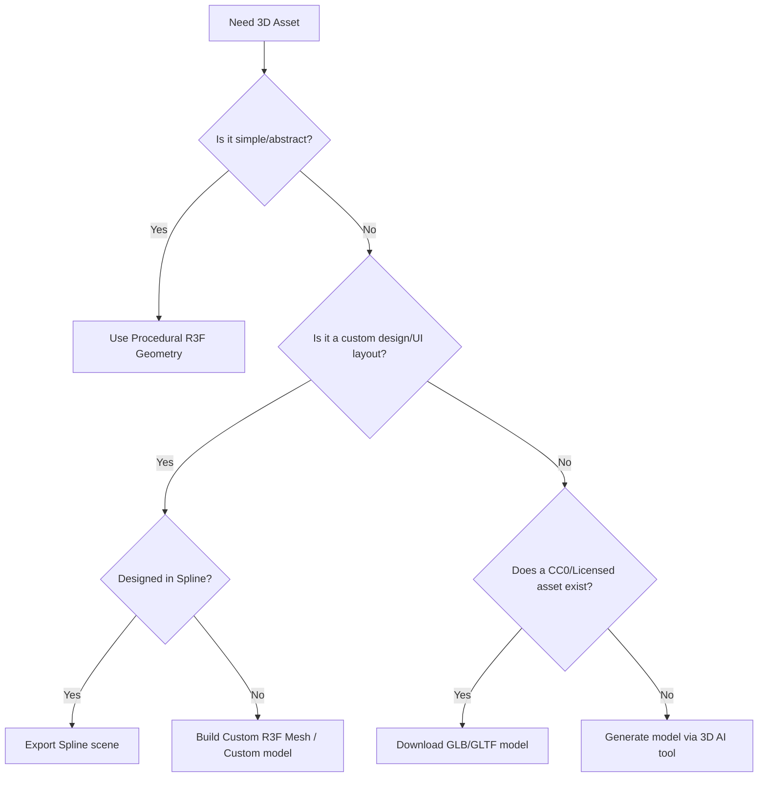

# 3D Model Prompt and Import System

## Purpose

All 3D models imported into this project must directly support the website's narrative, interaction model, or product presentation. Unoptimized, irrelevant, or generic 3D decorations are prohibited.

## Model Decision Tree

Before sourcing or modeling any 3D asset, use this decision tree to choose the most efficient implementation:



- **Procedural R3F geometry**: Use React Three Fiber shapes (box, sphere, cylinder, custom buffer geometries) for abstract hero concepts, particles, and simple UI layouts. This has zero network overhead and compiles instantly.
- **Downloaded GLB/GLTF model**: Use high-quality, pre-made CC0/royalty-free assets when they precisely fit the concept. Always check the licensing before downloading.
- **Generated model**: Use generative 3D tools only for simple, non-critical background items that require low complexity.
- **Spline scene/export**: Use Spline for rapid prototyping or if the visual designer delivered the complete scene in Spline format. Keep in mind the library runtime size overhead.
- **Custom modeled asset**: Build custom assets using Blender or equivalent when specific brand shapes, clean topology, or high performance are required.
- **No model**: Avoid 3D entirely if a clean, layered 2D layout achieves the same level of user engagement.

## Model Role Checklist

* **Model name**: [e.g., product-casing-v1]
* **Role**: [e.g., Central interactive hero object]
* **Section**: [e.g., Hero Canvas]
* **Purpose**: [How does this model support the story or product?]
* **Needed detail level**: [Low / Medium / High]
* **Interaction**: [e.g., Mouse hover hover-rotation, drag to rotate, scroll progress scroll-sync]
* **Animation**: [e.g., Vertex shader wave, skeleton armature loop, none]
* **Material style**: [e.g., Frosted glass, brushed metallic, matte clay]
* **Lighting needs**: [e.g., Environment map only, two directional lights + shadow caster]
* **Performance budget**: [e.g., Under 1.5MB file size, under 30k vertices]
* **Fallback**: [e.g., Pre-rendered 2D WebP fallback sequence or static screenshot]
* **License source**: [e.g., CC0 Sketchfab, custom built]
* **Optimization plan**: [e.g., gltf-pipeline compression, texture resizing to 1k]

## 3D Model Prompt Template

If generating or custom-modeling an asset, use this structure to outline the specification:

```
Object Description: [e.g., A minimalist geometric sculpture consisting of interlocking metallic rings]
Style: [e.g., Industrial, futuristic, matte, premium editorial]
Scale: [e.g., Normalized bounding box, centered at origin, height equal to 2 units]
Material: [e.g., Polished chrome, rough concrete, opaque frosted glass]
Topology Preference: [e.g., Clean quads, low polycount, uniform mesh density]
Texture Style: [e.g., Procedural shader materials, clean non-overlapping UV layout]
Detail Level: [e.g., Low poly count, high-quality edges, bevels modeled for highlights]
Output Format Preference: [.gltf / .glb / .fbx]
Avoid: [Copyrighted characters, brand logos, excessive vertex counts, loose overlapping geometry]
```

## GLB/GLTF Requirements

To ensure rapid loading and smooth frame rates:
- **Prefer GLB**: Always deliver 3D assets in `.glb` format for web deployment, as it packs geometry and textures into a single binary file.
- **Clean scale**: Apply all transforms, rotations, and scales in Blender before export. Bounding boxes must represent the model's actual volume, and scale should be normalized to `1, 1, 1`.
- **Origin/pivot**: Place the origin/pivot point at the logical center of the model (or at the base for models sitting on planes) to ensure predictable positioning and rotation in Three.js.
- **Sensible naming**: Name materials, meshes, and textures logically in the source file. Avoid generic names like `Cube.001` or `Material_32`.
- **Avoid unnecessary animations**: Remove unused animation clips, empty bones, and excessive keyframes.
- **Remove hidden geometry**: Delete vertices, faces, and internal structures that will never be visible to the camera.
- **Compress textures**: Embed textures directly as compressed formats or load them separately as WebP images.
- **Draco/Meshopt compression**: Compress the geometry using `gltf-pipeline` or `gltfpack` with Draco or Meshopt compression. Remind the developer to wrap the loader in R3F with `<Suspense>`.
- **Viewer testing**: Test the exported model in an online GLTF viewer (e.g., gltf-viewer.donmccurdy.com) to verify textures, materials, and pivot integrity before adding it to the codebase.

## Texture Requirements

- **Optimized dimensions**: Keep textures at `1024x1024` or lower. Only use `2048x2048` for highly detailed hero objects. Never use `4096x4096` or higher.
- **Format compression**: Use WebP or KTX2 for texture images to minimize GPU memory consumption.
- **Map selectively**: Only load roughness, metalness, and normal maps if they contribute significantly to the visual quality. Remove ambient occlusion maps if shadows can be calculated dynamically or baked into the vertex colors.
- **Unused textures**: Delete all unused textures, testing maps, and embedded color swatches.

## Polycount Guidance

Since device capabilities vary, assess vertex and face counts within the context of the entire scene:
- **Very Light** (< 5,000 vertices): Safe for all mobile devices, background items, and complex multi-object scenes.
- **Safe** (5,000 - 15,000 vertices): Excellent for secondary interactive elements and standard UI components.
- **Moderate** (15,000 - 40,000 vertices): Suitable for the main hero asset on the page, provided materials and shaders are simple.
- **Risky** (40,000 - 100,000 vertices): Only acceptable for highly detailed product displays where it is the sole asset in the viewport. Requires mandatory Draco compression.
- **Too Heavy** (> 100,000 vertices): Prohibited. Must be retopologized, baked, or simplified before import.

*Note: Always judge performance by the overall frame rate (target 60 FPS) on medium-spec mobile devices rather than looking at polygon counts in isolation.*

## License Checklist

Before committing any model to the project, ensure you document its legal status:
- **Source**: [e.g., Sketchfab / TurboSquid / Custom]
- **URL**: [Link to source asset]
- **License**: [e.g., CC0, CC-BY 4.0, Custom Commercial]
- **Attribution required**: [Yes (specify text) / No]
- **Commercial use allowed**: [Yes / No]
- **Modifications allowed**: [Yes / No]
- **Redistribution allowed**: [Yes / No]
- **Logged**: Confirm the entry is logged in [asset-license-log.md](file:///C:/Users/HP/Documents/3D%20System/3D-Website-System-/assets-briefs/asset-license-log.md).

## Approved Source Reminder

Refer to [approved-libraries.md](file:///C:/Users/HP/Documents/3D%20System/3D-Website-System-/component-sources/approved-libraries.md) and [asset-license-log.md](file:///C:/Users/HP/Documents/3D%20System/3D-Website-System-/assets-briefs/asset-license-log.md) before importing any model.

## Forbidden Assets

Never import the following assets:
- **Ripped models**: Assets extracted from commercial video games, movies, or anime without license.
- **Copyrighted brands**: Models depicting real-world trademarked logos, car designs, or copyrighted characters without explicit authorization.
- **Unclear licenses**: Any model sourced from a sharing site that lacks a clear, written license policy.
- **Adult content**: Any models containing mature or suggestive elements.
- **Weapons/Gambling**: Models representing firearms, weapons, or gambling equipment.
- **Unoptimized assets**: Raw, uncompressed CAD files, sculpting exports, or models with zero optimization plan.

## Final Rule

No asset may enter the codebase without a clear, documented license. Every external model must be optimized and logged in [asset-license-log.md](file:///C:/Users/HP/Documents/3D%20System/3D-Website-System-/assets-briefs/asset-license-log.md).
