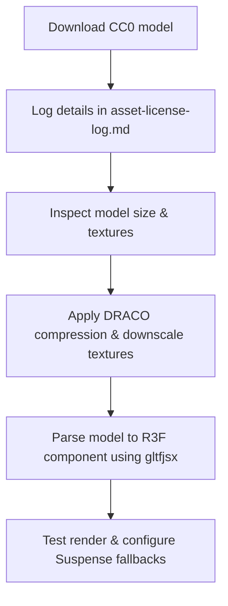

# Workflow: Asset Import & Optimization

Follow this workflow to download, audit, optimize, and integrate 3D models, textures, video files, and vector assets.

---

## 1. 3D Model Optimization Pipeline



### Step 1 — Licensing Check & Logging
- Validate that the model source is CC0 or has a compatible open-source license.
- Append a registry block in `assets-briefs/asset-license-log.md` with: Name, URL, Source, License, and Optimization details.

### Step 2 — Optimization Commands
- Compress the mesh and optimize the texture memory (texture resolutions should not exceed 1K/2K):
  ```bash
  # Convert to compressed GLB format using gltf-pipeline
  npx gltf-pipeline -i model.gltf -o public/models/model.glb -d
  ```

### Step 3 — Parsing to Component
- Convert the binary GLB file into a clean, typed React component:
  ```bash
  # Generate typescript component layout
  npx gltfjsx public/models/model.glb --typescript
  ```
- Move the output file to `src/components/scene/models/` and clean up default lights or cameras if they are already defined globally.

---

## 2. Image Optimization Pipeline

- **Preferred Format**: Convert JPG/PNG files to WebP or AVIF.
- **Commands**:
  ```bash
  # Convert image using sharp (if node script exists) or web encoder
  cwebp -q 80 image.png -o public/assets/image.webp
  ```
- **Execution Rules**:
  - Use `<picture>` tags to serve modern WebP/AVIF images with fallback formats.
  - Apply `loading="lazy"` to images located below the fold.

---

## 3. Video Optimization Pipeline

- **Preferred Formats**: Serve compressed WebM files with MP4 fallbacks.
- **Constraints**: Keep clips short, loop continuously, mute volume, and disable controls:
  ```html
  <video playsInline muted autoPlay loop poster="/assets/poster.webp">
    <source src="/assets/video.webm" type="video/webm" />
    <source src="/assets/video.mp4" type="video/mp4" />
  </video>
  ```
- **Rule**: Stop video playback loop when components are out of browser viewports (e.g. using IntersectionObserver).

---

## 4. SVG Optimization Pipeline

- **Source Check**: Clean exported code from tools like Figma or Adobe Illustrator.
- **Optimization Tools**: Run SVG code through SVGO or web parsers to strip editing metadata, empty metadata tags, and hardcoded IDs.
- **React Wrapping**: Wrap custom SVGs in functional components, using `currentColor` on fill/stroke attributes to match design theme tokens dynamically.
