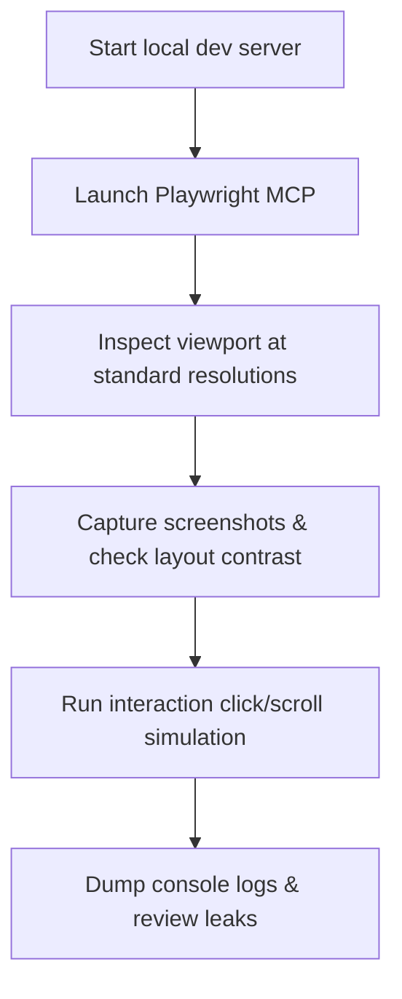

# Workflow: Browser QA

Follow this workflow using the Playwright MCP server to review visual presentation, responsiveness, and interaction mechanics.

---

## 1. Prerequisites

- The local development server must be running: `npm run dev` (usually binds to `http://localhost:5173`).
- Playwright MCP must be configured in `C:\Users\HP\.gemini\config\mcp_config.json`.

---

## 2. Execution Steps

### Step 1 — Navigation & Load Check
- Point Playwright to the local URL (e.g. `http://localhost:5173`).
- Inspect page load speeds and check for initial hydration bugs or console errors.

### Step 2 — Responsiveness Layout Inspection
- Query the page rendering at three standard viewports:
  - **Desktop**: 1440 x 900
  - **Tablet**: 768 x 1024
  - **Mobile**: 375 x 812
- Look for overlapping text blocks, cropped canvas renders, or non-responsive buttons.

### Step 3 — Interactivity & Hover Checks
- Simulate scroll down events. Verify that GSAP triggers coordinate animation increments cleanly.
- Simulate element hovers and clicks on all CTA buttons. Inspect focus rings and outline indicators.

### Step 4 — Log Checks
- Inspect the browser console log stack. Correct any uncaught exceptions, R3F webgl warnings, or duplicate asset download triggers.

---

## 3. Review Gate Questions

Before declaring any milestone complete, answer:
1. Did the build pass?
2. Are there any console errors?
3. Do all UI buttons contain keyboard focus states?
4. Is contrast readable when text overlays 3D canvas meshes?
5. Did we take screenshots of the mobile views?
